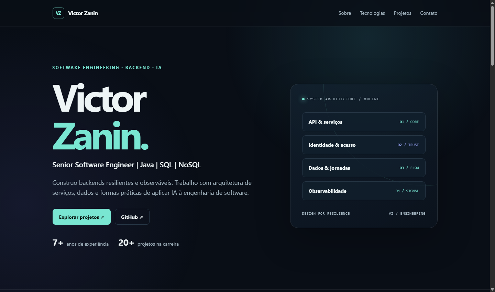

# Victor Zanin

**Senior Software Engineer · Java · SQL · NoSQL**

Backends resilientes, arquitetura de serviços, dados e IA aplicada à engenharia de software.

[**Conhecer o portfólio ↗**](https://victorzanin.github.io/about_me/) · [**Entrar em contato ↗**](https://victorzanin.github.io/about_me/#contato)

 

## Sobre

Tenho mais de **7 anos de experiência** em engenharia de software e participei de **mais de 20 projetos**. Minha atuação se concentra em backend, sistemas distribuídos, observabilidade e soluções práticas para o uso de IA no desenvolvimento de software.

No [portfólio](https://victorzanin.github.io/about_me/) você encontra minha stack e três frentes de trabalho: plataformas de produtos e identidade, resiliência de serviços e engenharia de software com IA.

## Este repositório

A página é uma single page estática, responsiva e feita com HTML e CSS. Não há etapa de build nem dependências para instalar. Para visualizar localmente, abra [`index.html`](index.html) no navegador.

O site é publicado pelo GitHub Pages a partir da raiz da branch `main`.

## Contato

[**zanin.victoradriano@gmail.com**](mailto:zanin.victoradriano@gmail.com) · [GitHub](https://github.com/victorzanin)
